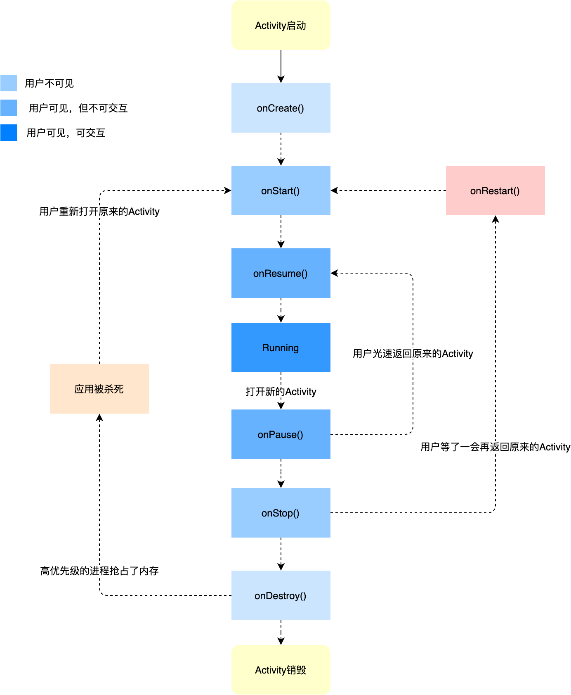
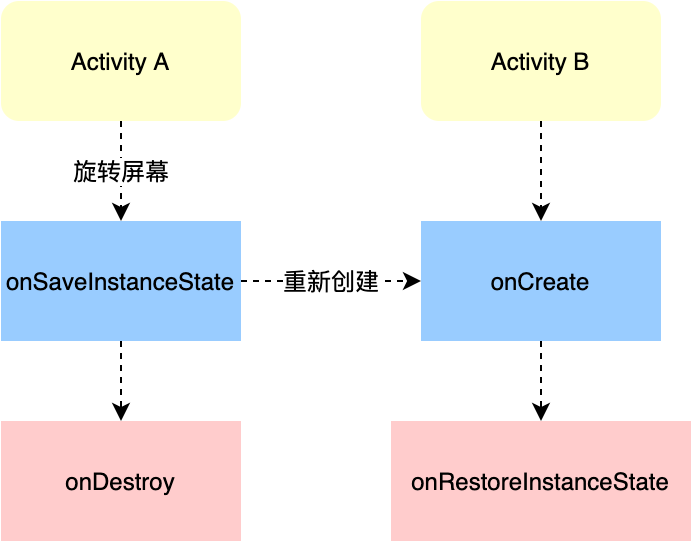
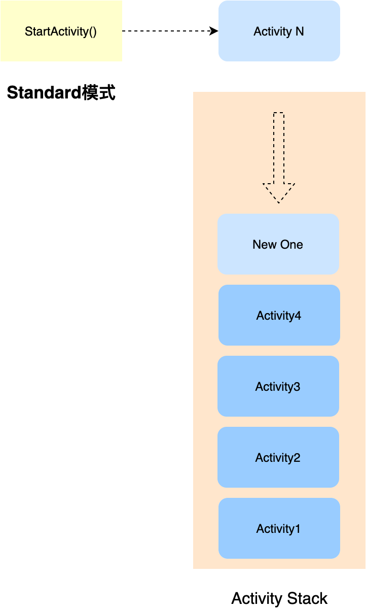
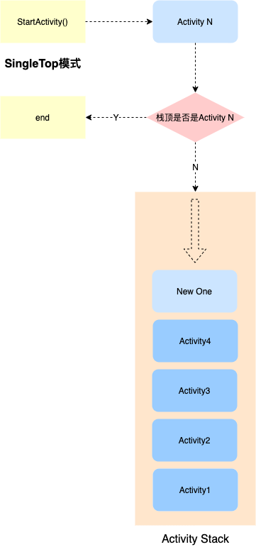
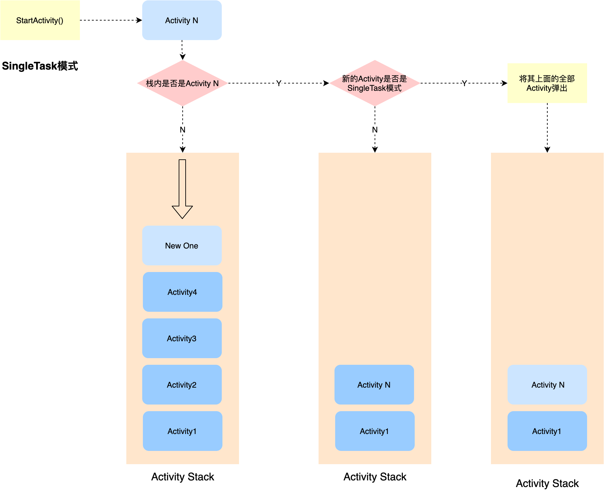
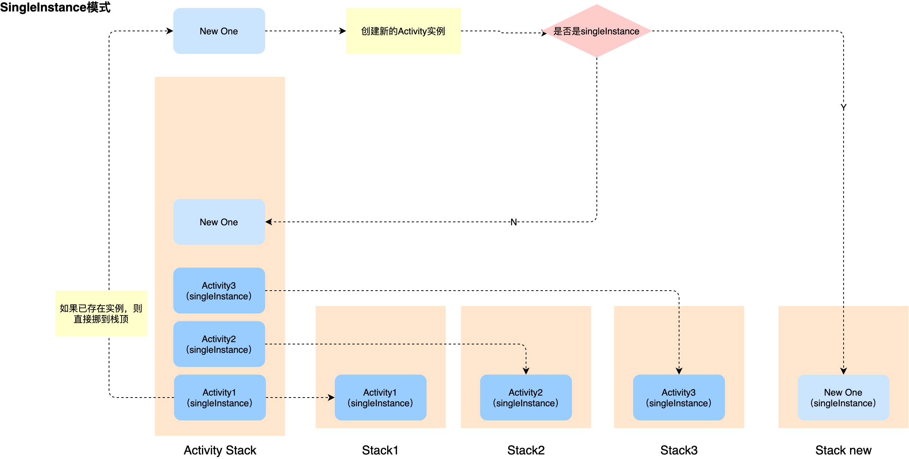

# Activity的工作原理

### 1. Activity的生命周期

- onCreate：表示Acitivity正在被创建，是生命周期的第一个方法，我们可以做一些初始化的操作，比如执行setContentView去加载布局资源，初始化所需要的数据。

- onRestart：表示Activity正在重新启动，Activity会从不可见变为可见，通常是用户行为导致

- onStart：表示Activity正在启动，此时是可见的，但是还没完全呈现在用户面前，还无法跟用户交互

- onResume：表示Activity已经可见，处于前台状态，可以跟用户交互了。

- onPause：表示Activity被停止，正常情况下，onStop会被调用。这一步通常用于执行一些存储数据，停止动画等工作，官方建议不要执行耗时操作，因为只有执行完onPause之后下一个Activity的onCreate才会被执行。

- onStop：这一步在下一个Activity的onResume执行完之后才执行，可以执行一些稍微重量级的回收操作，但是不要太耗时。

- onDestroy：表示Activity即将被销毁，是生命周期最后一个回调，我们可以做一些重量级的回收操作。
- 


#### 要知道的几个点

- A跳转到B ：A执行完onPause之后就会马上执行B的onCreate -> onStart -> onResume 然后才会执行A的 onStop，所以不要再onPause执行太重的操作。
- 当用户按back返回之后，会执行onPause -> onStop -> onDestroy
- 当 Activity 被回收之后再次打开，生命周期就会从 onCreate开始
- onPause ---- onResume，onStart --- onStop 看起来的确差不多，但是意义却差很远：
  - onPause ---- onResume 界限Activity是否位于前台，是否可以接收用户交互。
- onStart --- onStop 用于界限Activity是否可见，但不位于前台，所以无法与用户交互，例如前面弹了个Dialog。
- 当我们旋转手机的时候，Activity也会随之旋转，伴随着的是Activity的销毁与创建，而为了避免这种额外的开销，我们可以在AndroidMainfest中配置该Activity的configChanges，并重写onRestoreInstanceState、onSaveInstanceState，来恢复页面元素的内容。
- 




### 2. Activity Launch Mode

##### Standard  

只要点击跳转，就创建一个新的Activity实例塞入到Activity栈中。



#### SingleTop

先查看当前栈顶是否是目标Activity类型的实例，如果是，则不需要再创建新的Activity，否则，则创建新的Activity并塞入栈顶。



#### SingleTask

会先检查当前栈中是否存在目标Activity的实例，如果存在，则将该Activity之上的所有实例都弹出，然后保留该Activity的实例。如果不存在，则创建新的实例并压入栈顶。



#### SingleInstance

如果已经存在实例，则直接将该Activity移到栈顶，如果不存在，则创建一个新的Stack，并压入一个新的目标Activity实例




### 3. Intent的匹配规则

Intent解析机制主要是通过查找已注册在AndroidManifest.xml中的所有IntentFilter及其中定义的Intent，最终找到匹配的Intent，而Android是通过Intent的action、type、category这三个属性来进行匹配判断的。

##### （1） Action的匹配规则

action是一个字符串，Intent如果指定了action，则目标组件的IntentFilter列表中必须包含这个action，并且是精确匹配，大小写敏感。如果包含多个action，只满足一个也是可以匹配的，如果出现多个activity都匹配成功，系统会弹窗让用户选择用哪个activity来启动。

例如：

```
//activity

<intent-filter>

    <action android:name="android.intent.action.SEND"/>

    <action android:name="android.intent.action.SEND_TO"/>

</intent-filter> 


------------------------------------------------------------------------------


Intent intent = new Intent("android.intent.action.SEND") ;

startActivity(intent); //匹配成功
```


##### （2）data的匹配规则

data类似于url，匹配规则同action，Intent中的data只要与activity声明的任意一个data完全相同，就匹配成功。data由两部分组成:

- mimeType：指的是媒体类型，例如image/jpeg、auto/mpeg4、video/*等，可以表示图片、文本、视频等不同格式

- uri：scheme、host、port、path | pathPattern | pathPrefix 


例子：

- 如果我们想匹配 http已 .pdf 结尾的路径，使得程序可以打开网络pdf，我们可以将scheme设置为"http"，pathPattern设置为 ".*//.pdf"

```
<intent-filter>  

    <action android:name="android.intent.action.VIEW"></action>  

    <category android:name="android.intent.category.DEFAULT"></category>  

    <data android:scheme="http" android:pathPattern=".*//.pdf"></data>  

</intent-filter>  
```

- 如果想打开一个我们自己做的一个IM应用，则为我们的IM APP 配置如下Intent-filter，SEND表示要发送信息，mimeTpye表示可以接受任何数据

```
<intent-filter>  

    <action android:name="android.intent.action.SEND" />  

    <category android:name="android.intent.category.DEFAULT" />  

    <data mimeType="*/*" />  

</intent-filter>  
```

- 如果我们做的是一个视频播放app，希望其他app打开我们的app，就可以做如下配置，audio表示是视频

```
<intent-filter>  

     <action android:name="android.intent.action.VIEW" />  

     <category android:name="android.intent.category.DEFAULT" />  

     <data android:mimeType="audio/*" />  

</intent-filter>  
```

##### （3）category的匹配规则

category也是一个字符串，但是匹配规则跟action完全不同，它要求如果intent含有某个categor，那么所有的category都必须在Intent-filter中定义，才匹配成功。

